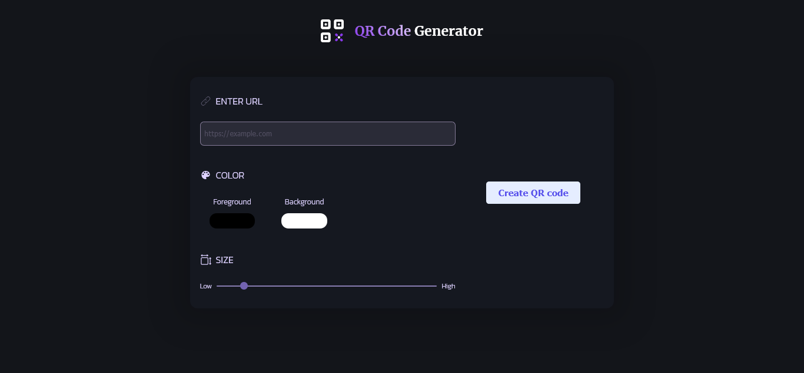
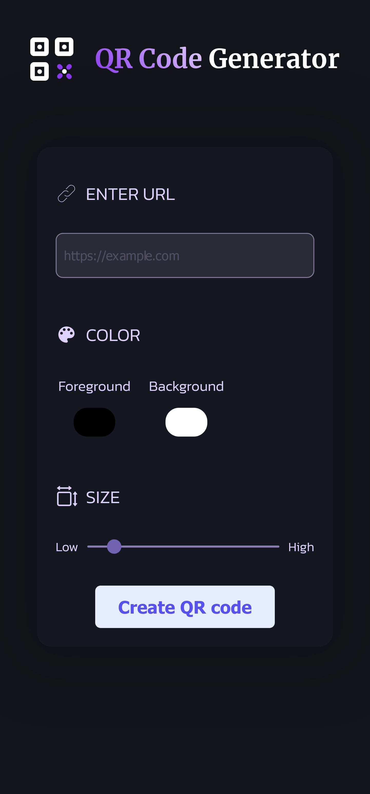

# QR Code Generator

This is a simple QR code generator that allows you to create QR codes for any URL.

## Installation

To install the QR code generator, simply clone this repository:

```bash
git clone
```

Then navigate into the project directory and run `npm install` to download all dependencies:

```bash
cd qr-code-generator
npm install
# or
yarn
```

## Usage

To run the QR code generator, run the following command:

```bash
npm run dev
# or
yarn dev
```

## Built with

<ul>
  <li>HTML</li>
  <li>CSS</li>
  <li>Astro</li>
  <li>React</li>
</ul>


## Screenshot

### Desktop



### Mobile

<p align="center">
  
</p>

## Links

- Solution URL: [GitHub](https://github.com/MiguellPC/qrcode-generator)
- Live Site URL: [GitHub Pages](https://miguellpc.github.io/qrcode-generator/)

## Author

- GitHub - [Miguel Caixeta](https://github.com/MiguellPC)
- Linkedin - [Miguel Caixeta](https://www.linkedin.com/in/miguel-caixeta-39628a118/)
